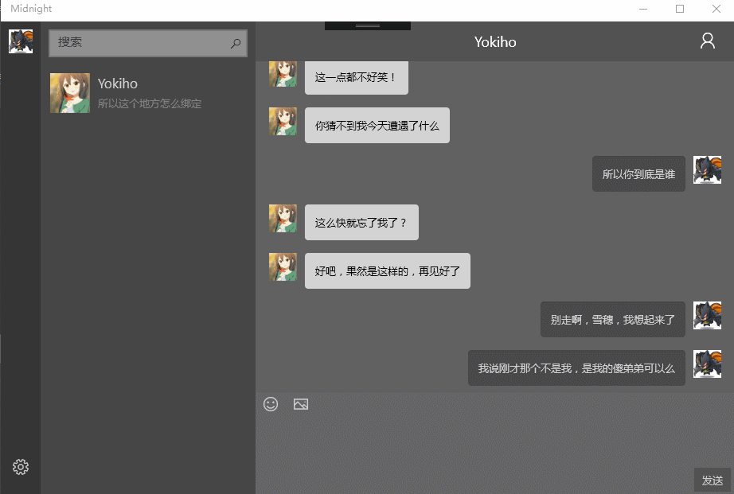
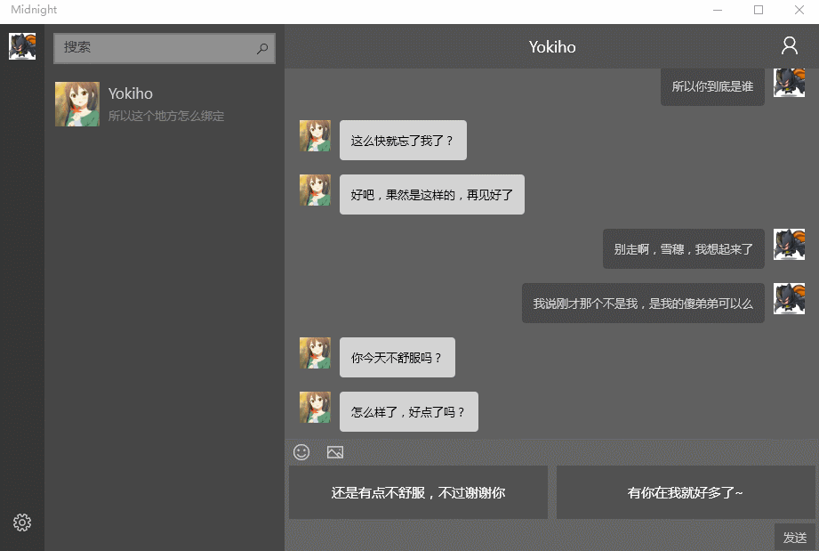

# MidnightSun

> This is a story about murder, betrayal
> 
> This is also a story about love
> 
> This is a journey under the midnight sun

*To be continued...*

---

## 2017.04.29 更新

**先看这里**：

1. master分支多了一个 "testDatabse" 文件夹，里面装了所有测试所用的db文件，请复制到自己的LacalState文件夹里。
2. 还没有做记录工作，所以每次打开聊天页面都会从头读取database里的内容，如果觉得聊天窗口信息太多，请步行至LocalState文件夹，打开ChattingInfo.db 文件，输入SQL语句：

> delete from ChattingItems
>
> where id > 11

3. 目前架构并不合理，一切聊天只发生在chattingPage里，这就意味着，离开页面后（如查看朋友圈），聊天会中断，与现实不符。
4. 存储剧情进展只需要存储：目前所在分支 (choose)，分支中的进展 count和总的分支长度即可。（目前chattingPage中的私有变量）

## Demo:

换一个选择试试：

---

## Task for 漂亮的福源姐姐

### Task 1

需要实现一个数据库负责记录剧情。每个数据库叫做X1, X10, X11, X2...(.db), X加一位数字代表主线剧情，X加两位数字代表用户选择的剧情。比如，如果用户在X1时选择了0，则进入X10， 如果选择了1，则进入X11，如果想写三线支线也是可以的，用X加三位数字就好了。

*next一般都为空字符串""*

**X1.db:**

id | msg | Next
------|------|----
1 | Hello | ""
2 | Thank you | ""
3 | Are you OK? | "choose"
4 | No, I'm not OK | ""
5 | Yes, I'm very Ok | ""

* **如何进入支线 (用户选择)**

如果一个元素的Next是choose，则它下面只有两个元素，分别代表用户的 0选择和 1选择，**然后我们的故事将会进入支线剧情**如X10, 或者 X11。

* **如何从用户支线选择模式返回主线:**

在支线最后一句话中的next，写一下需要返回的剧情文件名字，如X2

**X10.db:**

id | msg | Next
------|------|----
1 | You are not ok！ | X2

**X11.db:**

id | msg | Next
------|------|----
1 | You are ok！ | X2

最后一个元素next值不为空，直接进入 X2.db

----

## 剧情存储

2017.04.24更新：

在每一个数据库，记录一个关键词作为next的值，如"choose"，用于判断是否需要调起用户选择选项：

E.g.

**X1.db:**

id | msg | Next
------|------|----
1 | Hello | ""
2 | Thank you | ""
3 | Are you OK? | "choose"
4 | No, I'm not OK | ""
5 | Yes, I'm very Ok | ""

让用户选择，0 or 1，读入用户输入，0或1，加载X1之后，如X10, X11，进入下一个。

**X10.db:**

id | msg | Next
------|------|----
1 | You are not ok！ | X2

最后一个元素next值不为空也不为"choose"，直接进入 {Next}.db，即X2.db

**X11.db:**

id | msg | Next
------|------|----
1 | You are ok！ | X2

