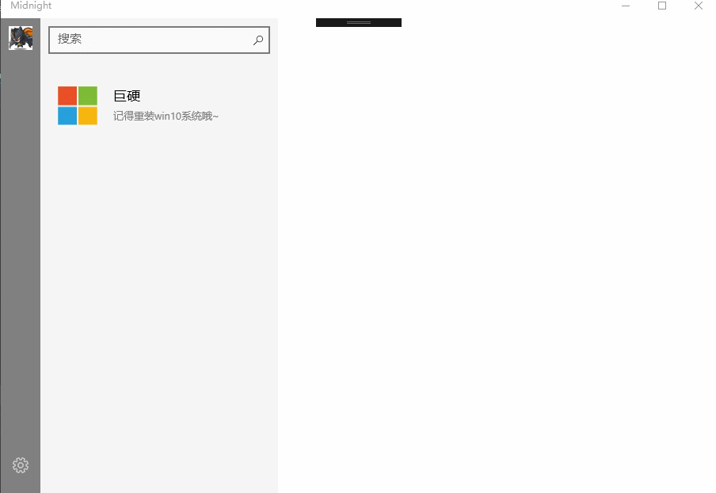

# MidnightSun

> This is a story about murder, betrayal
> 
> This is also a story about love
> 
> This is a journey under the midnight sun


*To be continued...*

---

## Demo:




---


## 剧情存储

*(Demo 不提供数据库，假设如下数据库已经实现的操作)*

---

2017.04.24更新 (先阅读原方法)：

在每一个数据库，记录一个关键词作为next的值，如"choose"，用于判断是否需要调起用户选择选项：

E.g.

**X1.db:**

id | msg | Next
------|------|----
1 | Hello | null
2 | Thank you | null
3 | Are you OK? | "choose"
4 | No, I'm not OK | null
5 | Yes, I'm very Ok | null

让用户选择，0 or 1，读入用户输入，0或1，加载X1之后，如X10, X11，进入下一个。

**X10.db:**

id | msg | Next
------|------|----
1 | You are not ok！ | X2

最后一个元素next值不为空，直接进入 X2.db

**X11.db:**

id | msg | Next
------|------|----
1 | You are ok！ | X2

设数据库中所有的元素为AllItems

```cs

int flag = -1; // (means do not read)
string choose[] = new string[2]; //Record choosing msg

foreach (var item in AllItems) {
    if (flag > -1) {
        choose[flag++] = item.msg;
    }
    if (item.next == "choose") {
        ++flag;
    }
}

```

----

原方法：

每个数据库只有最后一个的元素的Next的值可以是null或者非空。

如果跑完一个数据库：

**1. 最后一个元素的Next的值是null，读取用户输入，然后加在文件名里。**
**2. 最后一个元素的Next不是null，是例如"X2"，则直接读取Next对应值的db文件。**

---

E.g.

**X1.db:**

id | msg | Next
------|------|----
1 | Hello | null
2 | Thank you | null
3 | Are you OK? | null

读入用户输入，0或1，加载X1之后，如X10, X11，进入下一个。

**X11.db:**

id | msg | Next
------|------|----
1 | You are ok！ | X2

**X10.db:**

id | msg | Next
------|------|----
1 | You are not ok！ | X2

最后一个元素next值不为空，直接进入 X2.db

**X2.db:**

id | msg | Next
------|------|----
1 | Do you like MI4-I? |null

同理，读入用户输入，进入X21或X20

**X21.db:**

id | msg | Next
------|------|----
1 | You like MI4-I！ |null
2 | I'm very glad you like！ |X3

**X20.db:**

id | msg | Next
------|------|----
1 | Oh, You don't like MI4-I? |null
2 | You don't like me... |null
3 | Nevermind~ |X3

**X3.db:**

id | msg | Next
------|------|----
1 | I will give everyone a MI-Band! |null


......

