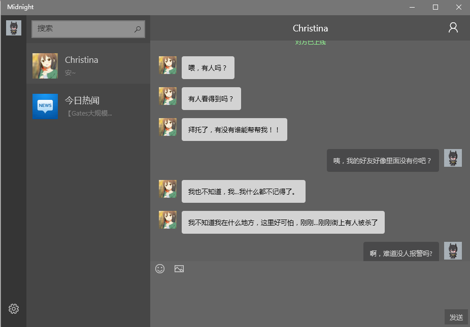
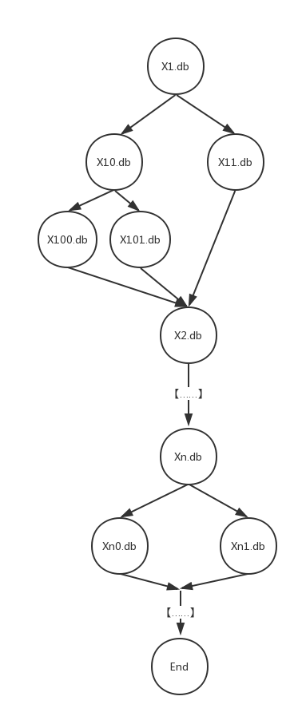

# MidnightSun

> This is a story about murder, betrayal
> 
> This is also a story about love
> 
> This is a journey under the midnight sun

---

Do you ever think about the authenticity of the world?

If the whole world is just a lie, what would you do?

Help her and find all the secrets

----

## 部分技术实现：

### 数据库部分：

剧情数据库table：
**X1.db**

id | msg | Flag
 ------|------|----
1 |  | **online**
2 |  | **time**
3 | Hello！ | 
4 | Are you OK？| 
5 | Yes, I'm OK | **choose0 / choose1**
6 | No, I'm not OK | 
7 | TA好帅! | **moment**
8 | | **offline**
9 | 专家研究认为打代码不会导致脱发 | **news**
10 | 60 | **delay**
11 | | **X2.db**

分支跳转示意图：

---

每次加载，并都会存入**process 进度**数据库db文件

id | databse | num | next
 ------|------|----|----
 1 | X1 | 5 | 2017-06-15/21:00:20
 
 ----
 
（1） 如果是聊天信息，通过聊天界面的viewModel更新并存入**chattingInfo（聊天记录）** 数据库
*更新照片时重写所有sender为player的avatarPath*
 
 id | sender |  msg | avatarPath
  ------|------|----|----
  1 | robot | 你好 | ms-appdata:///local/robot.jpg
  2 | player | 你是谁？ | ms-appdata:///local/20170615030220.jpg
  3 | time | 06-15/16:33 | 
  4 | online | 对方已上线 |
  5 | offline | 对方已下线 |

（2） 如果是朋友圈更新信息，朋友圈的viewModel更新并存入**朋友圈数据库**

 id | article |  image 
  ------|------|----
  1 | TA好帅 | ms-appdata:///local/ta.jpg
  
 （3） 如果是新闻信息，新闻viewModel更新，存入**新闻数据库**
 
  id | news |  time
  ------|------|----
  1 | 专家研究认为打代码不会导致脱发 | 2017-06-15/22:00

  ---